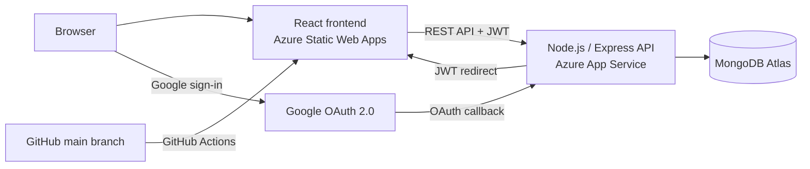

# PointPerks

PointPerks is a full-stack voucher redemption and loyalty platform built with the
MERN stack. Users earn points, discover vouchers, redeem rewards, download
voucher PDFs, and invite friends. Administrators manage vouchers, users,
redemptions, points, and platform analytics from a dedicated dashboard.

## Live Application

- Frontend: [PointPerks on Azure Static Web Apps](https://zealous-tree-00b654d00.7.azurestaticapps.net)
- Backend health: [PointPerks API health check](https://pointperks-backend-fjgaase6caaaejfz.malaysiawest-01.azurewebsites.net/api/health)
- Repository: [MuhammadShuhail-00/PointPerks](https://github.com/MuhammadShuhail-00/PointPerks)

## Features

### User experience

- Email/password registration and login
- Google OAuth 2.0 login
- JWT-based authentication and protected routes
- Points wallet and transaction history
- Voucher search, category filters, sorting, and pagination
- Voucher redemption with per-user and total redemption limits
- QR codes, redemption codes, and downloadable PDF vouchers
- Redemption cancellation with points refunds
- Referral codes and configurable referral rewards
- Responsive user dashboard and profile management

### Administration

- Role-protected admin dashboard
- Create, edit, activate, deactivate, and delete vouchers
- Manage users, roles, account status, and points
- View and manage redemption activity
- Mark vouchers as used or delete redemption records
- Analytics for users, vouchers, categories, growth, and redemption activity

## Architecture



| Layer | Technology |
| --- | --- |
| Frontend | React 19, React Router, Redux Toolkit, Axios, PrimeReact, Chart.js |
| Backend | Node.js, Express, Mongoose |
| Database | MongoDB Atlas |
| Authentication | JWT, Passport.js, Google OAuth 2.0, bcrypt |
| Validation and security | Joi, Helmet, CORS, Express Rate Limit |
| Documents | PDFKit, QRCode |
| Frontend hosting | Azure Static Web Apps |
| Backend hosting | Azure App Service |
| CI/CD | GitHub Actions for the frontend |

## Repository Structure

```text
PointPerks/
|-- .github/workflows/        # Azure Static Web Apps workflow
|-- voucher-frontend/
|   |-- public/               # Static assets and Azure SPA configuration
|   `-- src/
|       |-- components/       # Shared UI, layouts, and voucher components
|       |-- hooks/            # Authentication hook
|       |-- pages/            # Public, user, and admin screens
|       |-- services/         # Axios API client
|       |-- store/            # Redux store and slices
|       `-- utils/            # Formatting and download helpers
`-- voucher-backend/
    |-- config/               # MongoDB and Passport configuration
    |-- controllers/          # Request handlers
    |-- middleware/           # Auth, errors, and rate limits
    |-- models/               # Mongoose models
    |-- routes/               # REST API routes
    |-- seeds/                # Local development seed data
    |-- services/             # Points, PDF, and QR-code logic
    `-- utils/                # JWT, validation, referral, and response helpers
```

## Local Development

### Prerequisites

- Node.js 18 or newer
- npm
- A MongoDB Atlas cluster or local MongoDB instance
- A Google Cloud OAuth 2.0 Web Application client

### 1. Clone the repository

```bash
git clone https://github.com/MuhammadShuhail-00/PointPerks.git
cd PointPerks
```

### 2. Configure and run the backend

```bash
cd voucher-backend
npm install
```

Create `voucher-backend/.env`:

```env
PORT=5000
NODE_ENV=development

MONGO_URI=mongodb+srv://<username>:<password>@<cluster>/<database>

JWT_SECRET=<long-random-secret>
JWT_EXPIRES_IN=7d
SESSION_SECRET=<another-long-random-secret>

GOOGLE_CLIENT_ID=<google-oauth-client-id>
GOOGLE_CLIENT_SECRET=<google-oauth-client-secret>
GOOGLE_CALLBACK_URL=http://localhost:5000/api/auth/google/callback

CLIENT_URL=http://localhost:3000

SIGNUP_BONUS_POINTS=100
REFERRAL_REWARD_POINTS=50
REFERRAL_BONUS_POINTS=100
```

Generate secrets with Node.js:

```bash
node -e "console.log(require('crypto').randomBytes(64).toString('hex'))"
```

Start the API:

```bash
npm run dev
```

The local API runs at `http://localhost:5000`, with its health endpoint at
`http://localhost:5000/api/health`.

### 3. Configure and run the frontend

Open a second terminal:

```bash
cd voucher-frontend
npm install
```

Create `voucher-frontend/.env.local`:

```env
REACT_APP_API_URL=http://localhost:5000/api
REACT_APP_GOOGLE_REDIRECT=http://localhost:5000/api/auth/google
```

Start the React development server:

```bash
npm start
```

Open `http://localhost:3000`.

### 4. Optional local seed data

```bash
cd voucher-backend
npm run seed
```

The seed script replaces voucher data and creates development accounts. Review
the script before running it, and do not use seeded credentials in production.

## Google OAuth Configuration

Create an OAuth 2.0 Client ID with application type **Web application** in Google
Cloud Console.

### Authorized JavaScript origins

```text
http://localhost:3000
https://zealous-tree-00b654d00.7.azurestaticapps.net
```

### Authorized redirect URIs

```text
http://localhost:5000/api/auth/google/callback
https://pointperks-backend-fjgaase6caaaejfz.malaysiawest-01.azurewebsites.net/api/auth/google/callback
```

The backend handles Google's callback, creates a PointPerks JWT, and redirects
the browser to the frontend `/auth/callback` route.

## MongoDB Atlas Configuration

1. Create an Atlas project and cluster.
2. Create a database user with a strong password.
3. Add the backend's required network access rule.
4. Copy the driver connection string into `MONGO_URI`.
5. Include a database name in the URI.
6. Store the production URI in Azure App Service environment variables, never
   in Git.

The application stores users, vouchers, redemptions, referrals, and points
history in MongoDB.

## Environment Variables

### Backend

| Variable | Required | Purpose |
| --- | --- | --- |
| `PORT` | No | Local server port; defaults to `5000` |
| `NODE_ENV` | Yes | `development` or `production` |
| `MONGO_URI` | Yes | MongoDB connection string |
| `JWT_SECRET` | Yes | Signs and verifies access tokens |
| `JWT_EXPIRES_IN` | No | Token lifetime; defaults to `7d` |
| `SESSION_SECRET` | Yes | Express session signing secret |
| `GOOGLE_CLIENT_ID` | Yes | Google OAuth client ID |
| `GOOGLE_CLIENT_SECRET` | Yes | Google OAuth client secret |
| `GOOGLE_CALLBACK_URL` | Yes | Backend OAuth callback URL |
| `CLIENT_URL` | Yes | Allowed frontend origin and post-login destination |
| `SIGNUP_BONUS_POINTS` | No | New-user points; defaults to `100` |
| `REFERRAL_REWARD_POINTS` | No | Referrer reward; defaults to `50` |
| `REFERRAL_BONUS_POINTS` | No | Referred-user reward; defaults to `100` |

### Frontend

| Variable | Required | Purpose |
| --- | --- | --- |
| `REACT_APP_API_URL` | Yes | Backend API base URL, including `/api` |
| `REACT_APP_GOOGLE_REDIRECT` | Yes | Backend endpoint that begins Google login |

Frontend variables are embedded at build time and must not contain secrets.

## API Overview

All endpoints use the `/api` prefix.

| Area | Base route | Access |
| --- | --- | --- |
| Authentication | `/auth` | Public and authenticated |
| Users and points | `/users` | User; management endpoints require admin |
| Vouchers | `/vouchers` | Public reads; writes require admin |
| Redemptions | `/redemptions` | Authenticated; management requires admin |
| Referrals | `/referrals` | Public validation, user history, admin listing |
| Analytics | `/analytics` | Admin only |
| Health | `/health` | Public |

Protected requests send:

```http
Authorization: Bearer <jwt>
```

Notable voucher endpoints:

| Method | Endpoint | Access | Description |
| --- | --- | --- | --- |
| `GET` | `/api/vouchers` | Public/optional auth | Filtered and paginated voucher list |
| `GET` | `/api/vouchers/:id` | Public/optional auth | Voucher details |
| `POST` | `/api/vouchers` | Admin | Create a voucher |
| `PUT` | `/api/vouchers/:id` | Admin | Edit a voucher |
| `PATCH` | `/api/vouchers/:id/toggle` | Admin | Toggle active status |
| `DELETE` | `/api/vouchers/:id` | Admin | Delete or deactivate a voucher |
| `POST` | `/api/redemptions` | User | Redeem a voucher |
| `GET` | `/api/redemptions/:id/pdf` | User/admin | Download voucher PDF |
| `POST` | `/api/redemptions/:id/cancel` | User/admin | Cancel and refund points |

## Points Rules

| Event | Default effect |
| --- | --- |
| New account | `+100` points |
| Successful referral | Referrer receives `+50` points |
| Referral-code signup | New user receives `+100` points |
| Voucher redemption | Deducts the voucher's configured points cost |
| Redemption cancellation | Refunds the deducted points |
| Admin adjustment | Adds or deducts a specified amount |

All configurable rewards can be changed through backend environment variables.

## Deployment

### Frontend: Azure Static Web Apps

The workflow in `.github/workflows/azure-static-web-apps-zealous-tree-00b654d00.yml`
runs for pushes and pull requests targeting `main`.

It:

1. Checks out the repository.
2. Builds `voucher-frontend`.
3. Injects the production API and Google-login URLs.
4. Deploys the `build` directory to Azure Static Web Apps.

`voucher-frontend/public/staticwebapp.config.json` rewrites client-side routes
such as `/auth/callback` to `index.html`.

The deployment token is stored in the GitHub Actions secret:

```text
AZURE_STATIC_WEB_APPS_API_TOKEN_ZEALOUS_TREE_00B654D00
```

### Backend: Azure App Service

Deploy the contents of `voucher-backend` to the `pointperks-backend` App Service.
Configure all backend environment variables under **Environment variables** in
the Azure portal, set `NODE_ENV=production`, and restart the App Service after
changing authentication secrets.

The Free F1 App Service plan has CPU and bandwidth quotas. If Azure reports
`Quota exceeded`, wait for the quota reset or temporarily scale the App Service
plan to Basic B1.

### Production URL changes

When the frontend URL changes:

1. Update backend `CLIENT_URL`.
2. Update Google OAuth's authorized JavaScript origin.
3. Rebuild/redeploy the frontend if its API URL changed.

When the backend URL changes:

1. Update `GOOGLE_CALLBACK_URL`.
2. Update Google OAuth's authorized redirect URI.
3. Update `REACT_APP_API_URL` and `REACT_APP_GOOGLE_REDIRECT`.

## Verification

Frontend production build:

```bash
cd voucher-frontend
npm run build
```

Backend startup:

```bash
cd voucher-backend
npm start
```

Health check:

```bash
curl http://localhost:5000/api/health
```

The backend currently has no automated test script. Frontend CI treats build
warnings as errors during Azure deployment.

## Security Notes

- Never commit `.env` files, database credentials, OAuth secrets, JWT secrets,
  session secrets, or Azure deployment tokens.
- Use different JWT and session secrets for local and production environments.
- Rotate `JWT_SECRET` immediately if a callback URL or bearer token is exposed.
  Rotation invalidates all existing sessions.
- Keep MongoDB Atlas network access as narrow as the deployment permits.
- Keep production secrets in Azure App Service environment variables.
- Keep Azure deployment credentials in GitHub Actions secrets.
- Do not share OAuth callback URLs containing a `token` query parameter.

## Troubleshooting

| Problem | Check |
| --- | --- |
| Google login redirects to `localhost` | Frontend production variables and Azure workflow environment |
| Google returns `redirect_uri_mismatch` | Exact callback URI in Google Cloud Console |
| `/auth/callback` returns Azure 404 | `public/staticwebapp.config.json` is present in the deployed build |
| Browser reports a CORS error | Backend `CLIENT_URL` matches the frontend origin exactly |
| API returns `401 Invalid token` | Sign in again after a JWT secret rotation |
| API returns `403 Admins only` | The MongoDB user record has role `admin` |
| App Service restart fails | Check App Service **Quotas** and subscription status |
| Voucher validation fails | Read the field-specific error shown by the admin form |

## Collaboration

Create feature branches from the latest `main`:

```bash
git switch main
git pull origin main
git switch -c feature/your-change
```

Push the branch and open a pull request:

```bash
git add .
git commit -m "Describe the change"
git push -u origin feature/your-change
```

